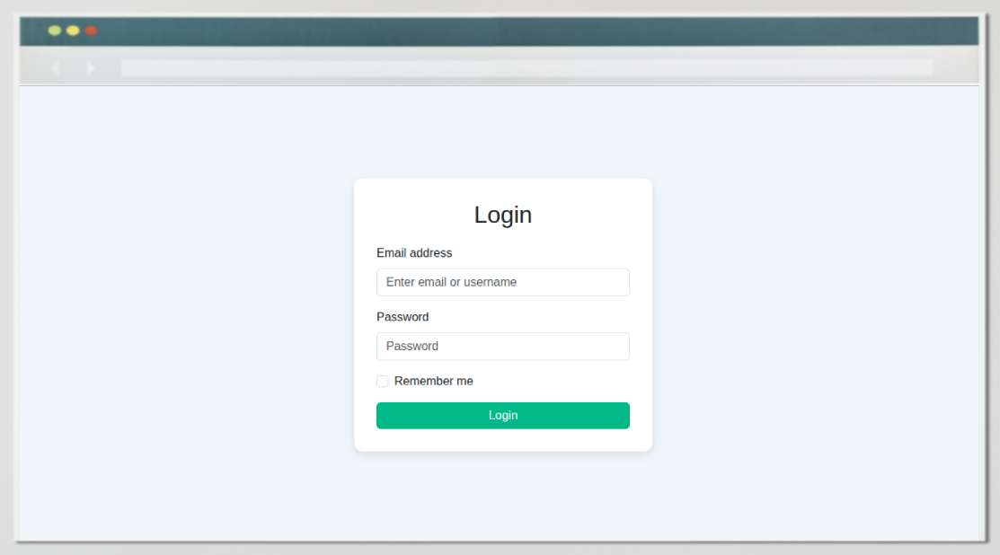
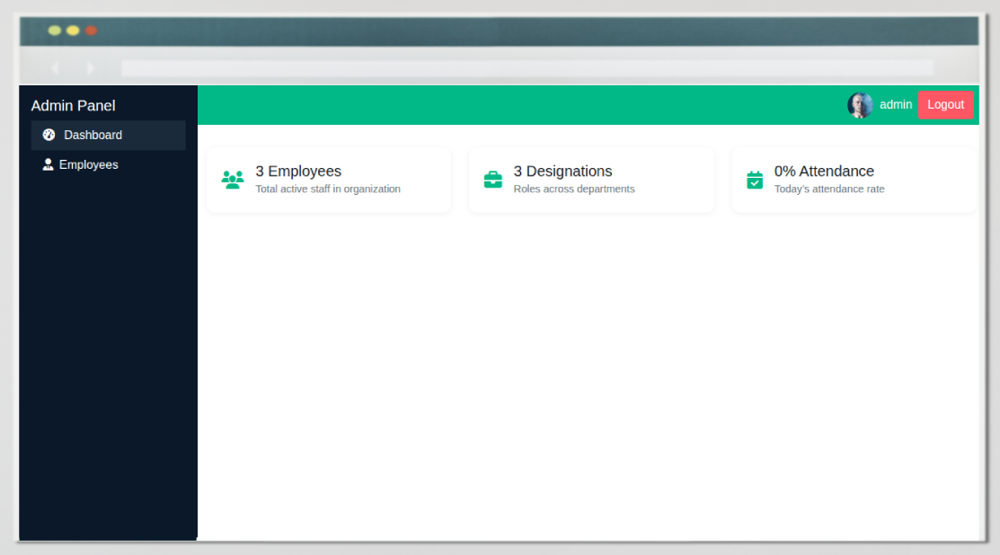
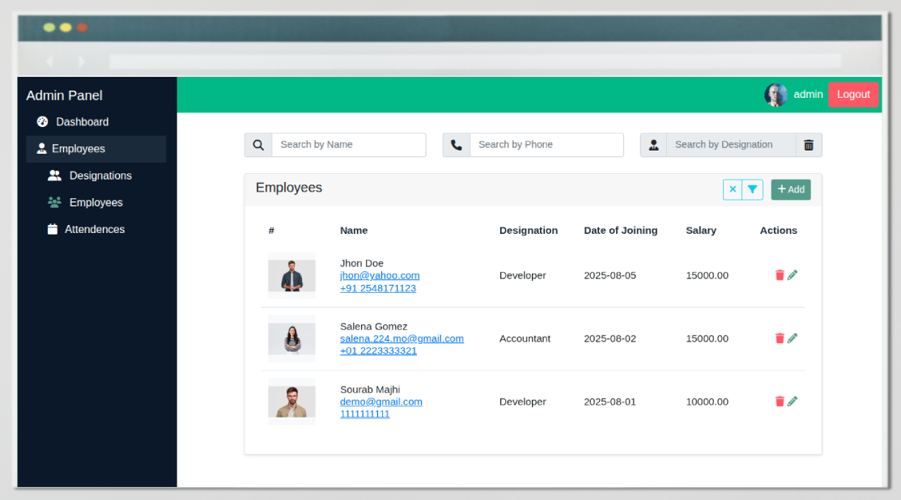
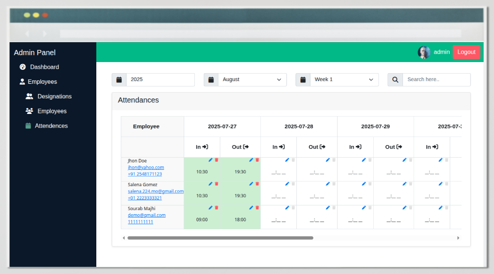
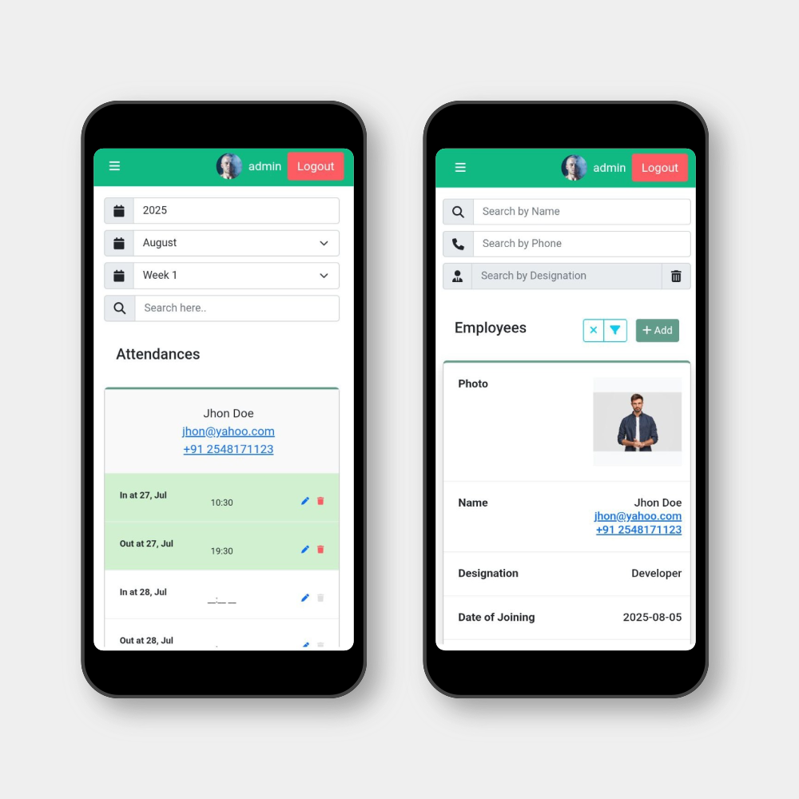

# 🕒 Online Employee Attendance Sheet

This is web-based platform allows organizations to accurately track employee attendance, manage work hours, and analyze attendance patterns. Employees can record their check-in and check-out times, or administrators can manage them. 

The platform works smoothly on both mobile and desktop browsers, making it accessible anytime, anywhere.

## 🛠️ Tech Stack

- **Laravel** – Robust PHP backend framework  
- **Livewire** – Reactive components for Laravel  
- **Boostrap CSS** – Modern utility-first styling  
- **Alpine.js** – Lightweight interactivity  
- **MySQL/PostgreSQL** – Relational database
- **Supabase** – Cloud storage for image uploads

---

## 📸 Screenshots








## 💻 Setting Up Locally

### 1. Clone the Repository

```bash
git clone https://github.com/demonize-c/online-employee-attendance-sheet.git
cd online-employee-attendance-sheet
```

### 2. Install Dependencies
```bash
composer install
npm install && npm run build  
```

### 3. Setup Environment File
```bash
cp .env.example .env
php artisan key:generate
```

### 4. Configure Database
Update the .env file with your database credentials:
```
DB_CONNECTION=mysql
DB_HOST=127.0.0.1
DB_PORT=3306
DB_DATABASE=your_database_name
DB_USERNAME=your_username
DB_PASSWORD=your_password
```
Then run the migrations:
```bash 
php artisan migrate
```

### 5. Configure Supabase Storage
This application use Supabase Storage to store files (like employee pictures). Update the following to your .env file:

```
SUPABASE_API_ENDPOINT=https://your-project.supabase.co
SUPABASE_API_KEY=your-service-role-key
SUPABASE_BUCKET=your_bucket_name
```

### 6. Serve the Application
```bash
php artisan serve
```
Visit: [http://127.0.0.1:8000](http://127.0.0.1:8000).
You're now running the app locally 🎉